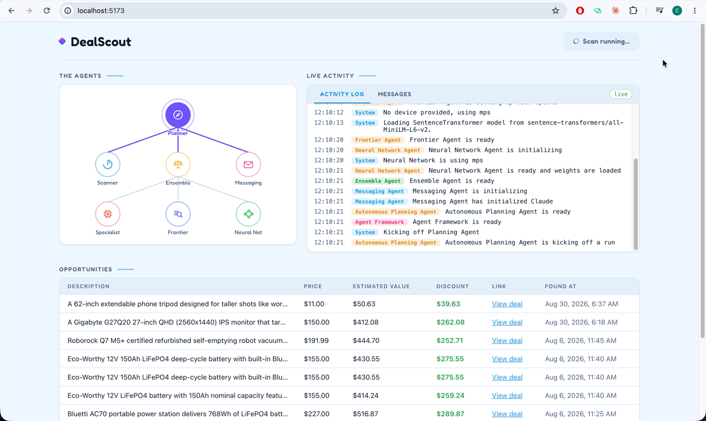

# DealScout

> An autonomous multi-agent deal-hunting system: a tool-calling LLM planner orchestrates seven agents that scrape live deal feeds, estimate each item's true market value with a **three-model pricing ensemble** — a QLoRA fine-tuned Llama 3.2 3B on serverless GPU, a RAG pipeline over a product vector store, and a 289M-parameter PyTorch neural network — and alert the user when the discount is real.

It combines a FastAPI backend, a WebSocket log bus that streams every agent's activity live into the browser, SQLite persistence with cross-run deal memory, serverless GPU inference on Modal, and a React dashboard with a real-time animated agent hierarchy — the ensemble's estimate beats every zero-shot frontier model it was benchmarked against, including GPT-5.1.

## Table of Contents

- [Demo / links](#demo--links)
- [Preview](#preview)
- [Key Highlights](#key-highlights)
- [The Pricing Ensemble](#the-pricing-ensemble--three-independent-models) — QLoRA fine-tune, RAG, 289M-param DNN, benchmark results
- [High-Level Product Flow](#high-level-product-flow)
- [Technical Deep Dive](#technical-deep-dive-click-below-to-expand) — agent architecture, scan lifecycle, API/schema reference, local setup
- [What This Project Demonstrates](#what-this-project-demonstrates)
- [Author](#author)

## Demo / links

| Resource | Link |
| --- | --- |
| API docs | Run locally, then open <code>http://localhost:8000/docs</code> |
| Base model | [meta-llama/Llama-3.2-3B](https://huggingface.co/meta-llama/Llama-3.2-3B) (QLoRA fine-tuned for price prediction) |
| Training data source | [McAuley-Lab/Amazon-Reviews-2023](https://huggingface.co/datasets/McAuley-Lab/Amazon-Reviews-2023) |

## Preview

### Full Agentic Pipeline Demo

One click on **Run Scan** and the whole system runs autonomously: the planner LLM decides its own tool sequence, ~30 deals are scraped and filtered to 5, each is priced by all three ensemble models (watch the pyramid light up agent-by-agent in its own color as the logs stream beside it), and the best bargain pops up as a Claude-crafted alert.

<video src="docs/media/dealscout-demo.mp4" controls muted playsinline width="720">
  Your browser doesn't support inline video — <a href="docs/media/dealscout-demo.mp4">watch the DealScout demo</a>.
</video>

### Live dashboard mid-scan

The currently-working agent pulses in its own color, driven purely by parsing the real-time log stream — no dedicated backend events needed.

## Key Highlights

| Capability | Implementation |
| --- | --- |
| Autonomous LLM orchestration | The planner is not a hardcoded pipeline — GPT-5.1 is handed three tools (`scan`, `estimate_true_value`, `notify`) and loops on its own tool calls until it decides the job is done. The scan → 5× estimate → single notify sequence emerges from the model's own planning. |
| Three-strategy pricing ensemble | Every deal is priced independently by a QLoRA fine-tuned Llama 3.2 3B (serverless GPU), a RAG pipeline (Chroma + GPT-5.1), and a 289M-parameter residual DNN (local inference), then blended — the ensemble outperforms every individual model *and* every zero-shot frontier model benchmarked. |
| Fine-tuned open-source model in production | The Llama 3.2 3B fine-tune is served on Modal with 4-bit NF4 quantization on a T4 GPU, scale-to-zero, with a persistent HF cache volume for warm restarts — real serverless LLM deployment, not a notebook. |
| Cross-run deal memory | Previously surfaced deal URLs are reconstructed from SQLite into the planner's memory each run, so the system never re-alerts the same deal — persistence and agent state cleanly separated (sync agent code never touches the async DB). |
| Live agent observability | A pub/sub LogBus taps Python's `logging` via a custom handler, parses each line's `[Agent Name]` prefix, and streams structured events over WebSocket — the frontend derives the entire animated agent-hierarchy visualization from log lines alone. |
| LLM-crafted alerts, persisted | When a bargain clears the bar, Claude Sonnet writes the alert copy; it's stored as a row in SQLite, listed in a Messages tab with timestamps, and popped as a celebration modal the moment the run completes. |
| Structured, guarded scraping | RSS feeds are scraped (feedparser + BeautifulSoup), then GPT-5-mini with **Structured Outputs** selects exactly 5 deals into a Pydantic schema — with explicit prompt guards against "$XXX off" traps being mistaken for prices. |

## The Pricing Ensemble — Three Independent Models

The core of DealScout is estimating what a product is *actually worth* from its text description alone. Three fundamentally different approaches are trained/built on the same curated dataset — **~800,000 products** scrubbed and rebalanced from Amazon-Reviews-2023 across 8 categories (electronics, appliances, automotive, tools, office, and more) — and combined:

### 1. Specialist Agent — QLoRA fine-tuned Llama 3.2 3B (serverless GPU)

- Base model `meta-llama/Llama-3.2-3B`, fine-tuned with **QLoRA**: 4-bit NF4 quantization with double quantization and fp16 compute, LoRA adapters trained via PEFT/TRL on the 800K-item price dataset framed as completion ("`What does this cost to the nearest dollar? … Price is $`").
- Deployed as a **Modal class on a T4 GPU**: the adapter is loaded onto the quantized base at container start, weights cached in a persistent volume, containers scale to zero when idle. Inference generates ≤5 tokens and regex-extracts the price.
- Result: the fine-tune drops error from **$110.72 (base model, 4-bit) to $39.85** — a 3B open-source model beating GPT-5.1 zero-shot ($44.74) on this task.

### 2. Frontier Agent — RAG over a product vector store

- Every product in the training set is embedded with `all-MiniLM-L6-v2` (384-dim sentence-transformer) into a **Chroma** vector store (20K products in this checkout's lite store; rebuildable against the full 400K set with `backend/scripts/build_vectorstore.py`).
- At estimate time, the deal description is embedded, the **5 most similar products and their real prices** are retrieved and injected as context, and GPT-5.1 prices the item with that grounding.
- RAG is the single biggest lever in the whole project: **$30.19 error vs $44.74 for the same model zero-shot**.

### 3. Neural Network Agent — 289M-parameter deep residual network

- A from-scratch PyTorch regression network: `HashingVectorizer` (5,000 binary features) → 4,096-wide input projection → **8 residual blocks** (Linear → LayerNorm → ReLU → Dropout → Linear → LayerNorm with skip connections) → scalar head. **289,128,449 trainable parameters.**
- Trained on all 800K items against normalized log-price with L1 loss, AdamW + cosine annealing, 5 epochs; predictions map back through `exp(pred·σ + μ) − 1`.
- Runs **fully locally** (MPS/CUDA/CPU auto-detected) — zero API cost, and at $46.49 error it beats several frontier models on its own.

### Preprocessing + blending

Before pricing, a GPT-5.1 preprocessor rewrites each scraped description into a normalized Title/Category/Brand/Description/Details form (matching the training data distribution), with per-call token and cost accounting. The three estimates are blended `0.8·frontier + 0.1·specialist + 0.1·neural_net`.

### Benchmark results

Mean absolute pricing error (USD, lower is better) on held-out test items from the curated dataset, evaluated with the same harness across all models:

| Model | Error ($) |
| --- | --- |
| Constant (mean) baseline | 106.18 |
| Linear regression | 101.56 |
| Random Forest | 72.28 |
| XGBoost | 68.23 |
| **Human** | 87.62 |
| GPT-4.1 Nano (zero-shot) | 62.51 |
| GPT-4.1 Nano (**fine-tuned** — got *worse*) | 75.91 |
| Gemini 3 Pro (zero-shot) | 50.54 |
| Claude Sonnet 4.5 (zero-shot) | 47.10 |
| GPT-5.1 (zero-shot) | 44.74 |
| Llama 3.2 3B base, 4-bit (zero-shot) | 110.72 |
| **Llama 3.2 3B + QLoRA fine-tune** | **39.85** |
| **Deep Neural Network (289M, from scratch)** | **46.49** |
| **GPT-5.1 + RAG** | **30.19** |
| **Ensemble (this system)** | **29.90** 🏆 |

Three storylines worth noticing: a QLoRA fine-tuned 3B open-source model beats every zero-shot frontier model; fine-tuning a *frontier* model (GPT-4.1 Nano) actually degraded it; and grounding with RAG beats both — with the ensemble best of all, at roughly a third of the human error.

## High-Level Product Flow

~~~mermaid
flowchart LR
    A["Run Scan click"] --> B["Planner LLM tool-calling loop"]
    B --> C["Scrape RSS feeds ~30 deals → top 5"]
    C --> D["Price each deal 3-model ensemble"]
    D --> E["Best bargain → Claude-crafted alert"]
    E --> F["SQLite + WebSocket → live dashboard + modal"]
~~~

## What This Project Demonstrates

- **The full applied-LLM stack in one system**: dataset curation → QLoRA fine-tuning → serverless GPU deployment → RAG → from-scratch deep learning → agentic orchestration → full-stack product.
- Autonomous agent design where the LLM owns the control flow (tool loop) instead of executing a hardcoded plan — with guardrails (single-notify enforcement, cross-run memory) where determinism matters.
- Honest model evaluation: three pricing strategies benchmarked against classical ML baselines, a human, and five frontier models — including a negative result (fine-tuning GPT-4.1 Nano made it worse) that motivated the open-source fine-tune.
- Production plumbing done right: sync agent code isolated from the async event loop (`asyncio.to_thread`), lazy expensive initialization, pub/sub log streaming, typed schemas end-to-end (Pydantic/SQLModel → TypeScript mirrors).
- A polished, observable frontend: real-time agent-activity visualization derived entirely from a log stream, WebSocket auto-reconnect with backoff, zero UI component libraries.

## Technical Deep Dive (click below to expand)

Agent architecture, scan lifecycle, ensemble internals, API/schema reference, and how to run it locally

### Agent Hierarchy

~~~mermaid
flowchart TD
    P["Autonomous Planning Agent GPT-5.1 · tool-calling loop"]
    P -->|"tool: scan_the_internet_for_bargains"| S["Scanner Agent feedparser + BS4 → GPT-5-mini Structured Outputs, top 5"]
    P -->|"tool: estimate_true_value (×5)"| E["Ensemble Agent 0.8·frontier + 0.1·specialist + 0.1·nn"]
    P -->|"tool: notify_user_of_deal (×1)"| M["Messaging Agent Claude Sonnet crafts the alert"]
    E --> PRE["Preprocessor GPT-5.1 rewrites description"]
    PRE --> SP["Specialist Agent QLoRA Llama 3.2 3B Modal · T4 GPU · 4-bit NF4"]
    PRE --> FR["Frontier Agent Chroma RAG (5 similars) + GPT-5.1"]
    PRE --> NN["Neural Network Agent 289M-param residual DNN local MPS/CUDA/CPU"]
~~~

### One Scan, End to End

~~~mermaid
sequenceDiagram
    participant UI as React client
    participant API as FastAPI /api/scan/run
    participant ENG as DealScoutEngine (worker thread)
    participant PLN as Planner (GPT-5.1 tool loop)
    participant MOD as Modal (Llama 3.2 3B, T4)
    participant DB as SQLite

    UI->>API: POST /api/scan/run
    API-->>UI: 202 {status: started} (BackgroundTasks)
    API->>ENG: asyncio.to_thread(engine.run)
    ENG->>DB: load surfaced URLs → planner memory
    ENG->>PLN: plan(memory)
    PLN->>PLN: tool: scan — 3 RSS feeds ×10 ≈ 30 deals, dedup vs memory, GPT-5-mini picks 5
    loop 5 selected deals
        PLN->>PLN: tool: estimate — preprocess (GPT-5.1)
        PLN->>MOD: specialist.price() — remote GPU
        PLN->>PLN: frontier: embed → Chroma top-5 → GPT-5.1
        PLN->>PLN: neural net: local forward pass
    end
    PLN->>PLN: tool: notify (once) — Claude crafts alert
    PLN-->>ENG: Opportunity + message
    ENG->>DB: persist Opportunity + AgentMessage (one commit)
    ENG-->>UI: run_complete over /ws/logs → modal + table row
    Note over UI: every log line above also streamed live over the WebSocket as it happened
~~~

Per run: ~30 pages scraped (each RSS entry's detail page is fetched and cleaned), 5 preprocessor rewrites, **15 price predictions** (5 deals × 3 models), 1 crafted alert. Typical wall time is a few minutes, dominated by the Modal cold start and the LLM calls — which is exactly why the run is a background task with results delivered over the WebSocket rather than a blocking HTTP response.

### The Autonomous Planner

`autonomous_planning_agent.py` gives GPT-5.1 three OpenAI function tools and loops while `finish_reason == "tool_calls"`. The prompt states the *goal* ("find the best bargain, notify once, reply OK"); the model chooses the calls. Two guardrails keep it honest:

- **Single-notify enforcement** — a second `notify_user_of_deal` call in the same run is logged and ignored.
- **Memory** — the scanner receives every previously surfaced deal URL (rebuilt from SQLite each run) and filters them out before selection, so the same deal is never alerted twice across runs.

### LogBus → Live Agent Visualization

`core/log_bus.py` is an asyncio pub/sub hub. A custom `logging.Handler` taps every `logging.info()` from agent code (running in worker threads), parses the `[Agent Name] message` prefix convention from `Agent.log()`, and republishes structured `{agent, message, timestamp}` events to all WebSocket subscribers on `/ws/logs`.

The frontend maps agent names to pyramid nodes (`AGENT_NODE_MAP`): the latest log line's agent becomes the **active** (pulsing) node, previously seen agents stay tinted as **visited**, and the edge feeding the active node lights up in that agent's color. The entire animation requires **zero dedicated backend events** — it's derived from logs the agents were already writing. A `run_complete` event (not a log line) ends the run, triggers an opportunities refresh, and pops the celebration modal.

The WebSocket hook auto-reconnects with exponential backoff and caps the in-memory buffer at 500 entries.

### Dataset Curation (upstream of this repo)

The training corpus was curated from `McAuley-Lab/Amazon-Reviews-2023`: 8 product-category metadata dumps parsed in parallel (ProcessPoolExecutor), scrubbed (token/char length windows, price bounds), **rebalanced by category and price** via weighted sampling to correct the raw data's skew, then split 800K train / 10K val / test and pushed to the Hugging Face Hub. The fine-tune, the DNN, and the vector store all build on this same dataset, which is what makes the benchmark table apples-to-apples.

### Modal Deployment (Specialist)

[backend/modal_app/pricer_service.py](backend/modal_app/pricer_service.py) defines the remote service: a Modal `@app.cls` on a **T4 GPU** that loads the 4-bit NF4 double-quantized base model plus the PEFT adapter (pinned to an exact HF revision) in `@modal.enter()`, with the HF hub cache on a persistent Volume so restarts skip the download. `min_containers = 0` → scales to zero, costs nothing idle. The backend calls it with `modal.Cls.from_name("pricer-service", "Pricer")(...).price.remote(text)` — deployed independently via `modal deploy`, versioned in this repo.

### Async Boundary Design

Every agent call (OpenAI SDK, `requests` scraping, Modal `.remote()`, PyTorch) is synchronous. The FastAPI layer never blocks: `DealScoutEngine.run()` executes the whole planning cycle in `asyncio.to_thread`, and only the engine — never agent code — touches the async SQLModel session. The planner deposits its results as plain attributes (`planner.opportunity`, `planner.message`); the engine persists both in a single commit after the thread returns. Agents are also **lazily initialized** on first run (model loads, Chroma/Modal connections are expensive), so API startup stays instant.

### API Overview

| Method | Route | Description |
| --- | --- | --- |
| POST | /api/scan/run | Kick off one autonomous planning cycle (202; runs as a background task, result arrives over the WebSocket) |
| GET | /api/opportunities | All surfaced deals, newest first |
| GET | /api/opportunities/{id} | One surfaced deal |
| GET | /api/messages | All Claude-crafted alert messages, newest first |
| WS | /ws/logs | Live structured agent-log stream + `run_complete` events |

### Database Schema

| Table | Key fields | Purpose |
| --- | --- | --- |
| opportunity | id, deal_description, deal_price, deal_url, estimate, discount, created_at | Every surfaced bargain; also the source of the planner's cross-run memory |
| agentmessage | id, content, deal_url, deal_price, estimate, discount, created_at | The Claude-crafted alert text shown in the Messages tab and celebration modal |

SQLite via async SQLModel/SQLAlchemy (aiosqlite); tables auto-create on startup. The agent-facing pydantic `Opportunity` and the DB-row `Opportunity` are deliberately distinct types, converted explicitly in `core/framework.py`.

### Frontend

React 19 + TypeScript + Vite, **zero component libraries** — the agent pyramid is hand-built SVG with per-agent CSS custom properties, `color-mix` tints, and CSS-animated pulse halos. Layout puts the pyramid and the live activity panel side by side in one viewport (built for demo recording). Tabs switch between the log stream and the persisted Messages history (with a new-message dot and refetch-on-completion); a celebration modal pops the crafted alert when a run finds a deal. Types in `api.ts` mirror the backend's Pydantic/SQLModel schemas 1:1.

### Tech Stack

| Layer | Technologies |
| --- | --- |
| Agents & LLMs | OpenAI SDK (GPT-5.1, GPT-5-mini structured outputs), litellm (Claude Sonnet, GPT-5.1), tool calling |
| Fine-tuning & serving | QLoRA (PEFT, bitsandbytes 4-bit NF4), Transformers, Modal (T4 GPU, scale-to-zero) |
| RAG & ML | ChromaDB, sentence-transformers (all-MiniLM-L6-v2), PyTorch (289M-param residual DNN), scikit-learn |
| Scraping | feedparser, BeautifulSoup |
| Backend | Python 3.12, FastAPI, Uvicorn, asyncio, WebSockets, SQLModel/SQLAlchemy (async SQLite), pydantic-settings, uv |
| Frontend | React 19, TypeScript, Vite, hand-built SVG visualization, oxlint |

### Backend and Frontend Architecture

| Area | Key files |
| --- | --- |
| App, CORS, lifespan, shared engine | [backend/app/main.py](backend/app/main.py) |
| Engine: run cycle, memory, persistence | [backend/app/core/framework.py](backend/app/core/framework.py) |
| Log pub/sub + `[Agent Name]` parsing | [backend/app/core/log_bus.py](backend/app/core/log_bus.py) |
| The seven agents + preprocessor | [backend/app/agents](backend/app/agents) |
| REST + WebSocket routers | [backend/app/routers](backend/app/routers) |
| DB tables + response schemas | [backend/app/models.py](backend/app/models.py) |
| Modal GPU service (deployed separately) | [backend/modal_app/pricer_service.py](backend/modal_app/pricer_service.py) |
| Vector store rebuild script | [backend/scripts/build_vectorstore.py](backend/scripts/build_vectorstore.py) |
| API client + WebSocket hook | [frontend/src/api.ts](frontend/src/api.ts), [frontend/src/useLogSocket.ts](frontend/src/useLogSocket.ts) |
| Pyramid, activity panel, modal, table | [frontend/src/components](frontend/src/components) |

### Local Setup

**Prerequisites:** Python 3.12 + [uv](https://github.com/astral-sh/uv), Node.js 18+, `OPENAI_API_KEY` and `ANTHROPIC_API_KEY`, and a Modal account (`modal token set`) with the `pricer-service` app deployed (`modal deploy backend/modal_app/pricer_service.py`).

~~~bash
uv sync
cp .env.example .env          # fill in your API keys
cd frontend && npm install && cd ..
./dev.sh                      # backend :8000 + frontend :5173, Ctrl+C stops both
~~~

Or separately: `uv run run.py` (backend) and `cd frontend && npm run dev`.

`data/` (gitignored) holds the Chroma product vector store and the DNN weights — copied in, or rebuild the store with `uv run python backend/scripts/build_vectorstore.py` (needs `HF_TOKEN`).

~~~text
backend/
  app/
    main.py          FastAPI app, CORS, lifespan, shared DealScoutEngine
    core/            engine (run cycle, persistence) + log bus
    agents/          planner, scanner, ensemble, specialist, frontier, neural net, messaging, preprocessor
    routers/         opportunities · scan · messages · ws
    models.py        SQLModel tables + read schemas
    config.py, db.py settings (.env) + async engine
  modal_app/         pricer_service.py — the Modal GPU class, deployed via `modal deploy`
  scripts/           build_vectorstore.py
frontend/            React 19 + TS + Vite dashboard
data/                gitignored — vector store, DNN weights, SQLite db
dev.sh · run.py      one-command dev runner · backend entrypoint
~~~

## Author

**M Chakradar reddy**
AI Engineer · Applied AI Engineer · LLM Engineer · Python Backend Engineer
